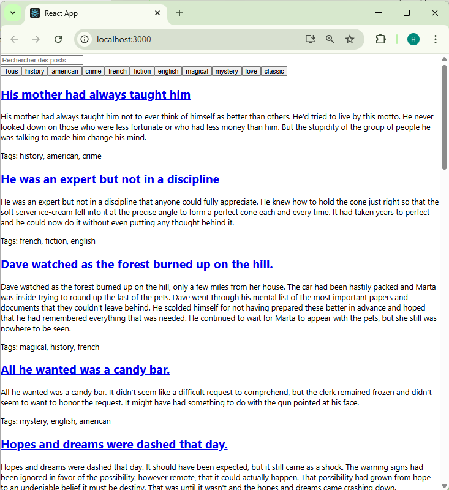
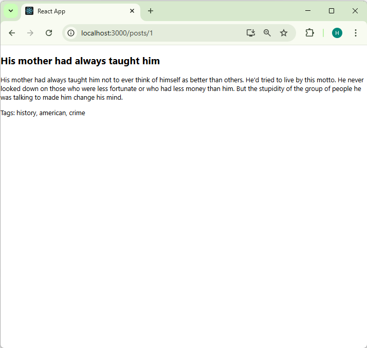

# Application de Blog avec React Hooks
## Introduction 

Ce TP a pour objectif de mettre en pratique l'utilisation des hooks React (useState, useEffect, useCallback, useMemo) ainsi que la création de hooks personnalisés à travers une application de blog simple. Nous avons utilisé l'API dummyjson.com pour récupérer des données fictives de posts de blog.

## Exercice 1 : État et Effets

### Objectif
Implémenter l'affichage et la recherche de posts.

### Tâches réalisées

1. Compléter le hook usePosts : Ce hook utilise useState et useEffect pour récupérer les posts depuis l'API dummyjson.com.
2. Implémenter le composant PostList : Ce composant affiche les posts récupérés.
3. Ajouter la fonctionnalité de recherche : Le composant PostSearch permet de filtrer les posts par titre ou contenu.

### Explication de la solution

```javascript
// Hook usePosts :
import { useState, useEffect } from 'react';
import axios from 'axios';

const usePosts = () => {
    const [posts, setPosts] = useState([]);
    const [loading, setLoading] = useState(true);
    const [error, setError] = useState(null);

    useEffect(() => {
        const fetchPosts = async () => {
            try {
                const response = await axios.get('https://dummyjson.com/posts');
                setPosts(response.data.posts);
                setLoading(false);
            } catch (err) {
                setError(err);
                setLoading(false);
            }
        };

        fetchPosts();
    }, []);

    return { posts, loading, error };
};

export default usePosts;
```

## Composant PostList :

```javascript
import React, { useState } from 'react';
import usePosts from '../hooks/usePosts';
import PostSearch from './PostSearch';

const PostList = () => {
  const { posts, loading, error } = usePosts();
  const [filteredPosts, setFilteredPosts] = useState(posts);

  const handleSearch = (query) => {
    const filtered = posts.filter(post =>
      post.title.toLowerCase().includes(query.toLowerCase()) ||
      post.body.toLowerCase().includes(query.toLowerCase())
    );
    setFilteredPosts(filtered);
  };

  if (loading) return <p>Chargement...</p>;
  if (error) return <p>Erreur : {error.message}</p>;

  return (
    <div>
      <PostSearch onSearch={handleSearch} />
      {filteredPosts.map(post => (
        <div key={post.id}>
          <h2>{post.title}</h2>
          <p>{post.body}</p>
        </div>
      ))}
    </div>
  );
};
export default PostList;
```


# Exercice 2 : Hooks Personnalisés

## Objectif

Créer des hooks réutilisables pour optimiser la recherche et persister les préférences utilisateur.

## Tâches réalisées

1. **Créer le hook** useDebounce : Ce hook optimise la recherche en retardant la mise à jour de la valeur de recherche.
2. **Créer le hook** useLocalStorage : Ce hook permet de persister les préférences utilisateur dans le localStorage.
3. **Utiliser ces hooks dans l'application**.

## Explication de la solution

**Hook** useDebounce :

```javascript
import { useState, useEffect } from 'react';

const useDebounce = (value, delay) => {
  const [debouncedValue, setDebouncedValue] = useState(value);

  useEffect(() => {
    const handler = setTimeout(() => {
      setDebouncedValue(value);
    }, delay);

    return () => {
      clearTimeout(handler);
    };
  }, [value, delay]);

  return debouncedValue;
};

export default useDebounce;
```
 **Hook** useLocalStorage :

 ```javascript
import { useState, useEffect } from 'react';

const useLocalStorage = (key, initialValue) => {
  const [storedValue, setStoredValue] = useState(() => {
    try {
      const item = window.localStorage.getItem(key);
      return item ? JSON.parse(item) : initialValue;
    } catch (error) {
      console.error(error);
      return initialValue;
    }
  });

  const setValue = (value) => {
    try {
      setStoredValue(value);
      window.localStorage.setItem(key, JSON.stringify(value));
    } catch (error) {
      console.error(error);
    }
  };

  return [storedValue, setValue];
};

export default useLocalStorage;

```

fin =============================================
## Aperçu Liste 




### Première image : Page de recherche des posts

- **Barre de recherche** : Permet de filtrer les posts par titre ou contenu.
- **Boutons de filtrage par tags** : Permettent de filtrer les posts par catégories (ex. : history, american, crime).
- **Liste des posts** : Affiche les posts avec leurs titres, contenus et tags associés.


## Aperçu Details





- **Titre du post** : Affiche le titre du post en haut de la page.
- **Contenu du post** : Affiche le contenu détaillé du post.
- **Tags** : Affiche les catégories associées au post (ex. : history, american, crime).
- **URL** : Montre l'URL dynamique pour les détails du post (ex. : `localhost:3000/posts/1`).

## Difficultés rencontrées

- **React Router** :
  - Installation manquante de `react-router-dom`.
  - Oubli d'importer `useParams` dans `App.js`.

- **Contexte (Context)** :
  - `ThemeContext` mal configuré ou non englobé autour de l'application.

- **Intégration API** :
  - Erreurs lors de la récupération des données depuis l'API.

- **Routage dynamique** :
  - Difficulté à configurer des routes dynamiques pour `PostDetails`.

- **Gestion de l'état** :
  - Problèmes de filtrage des posts par tags et requêtes de recherche.
 
